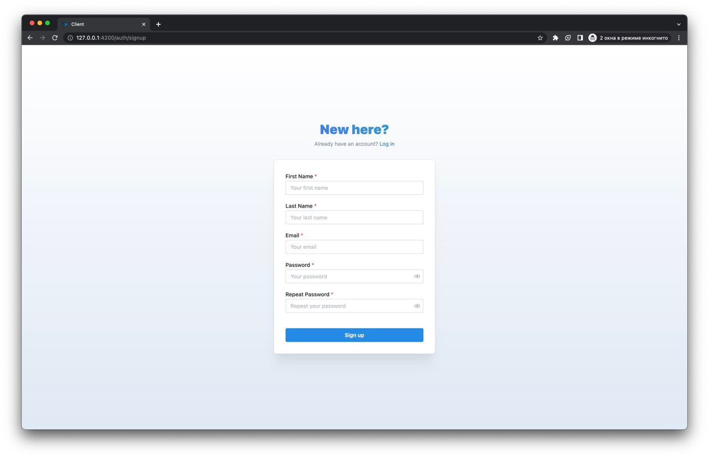
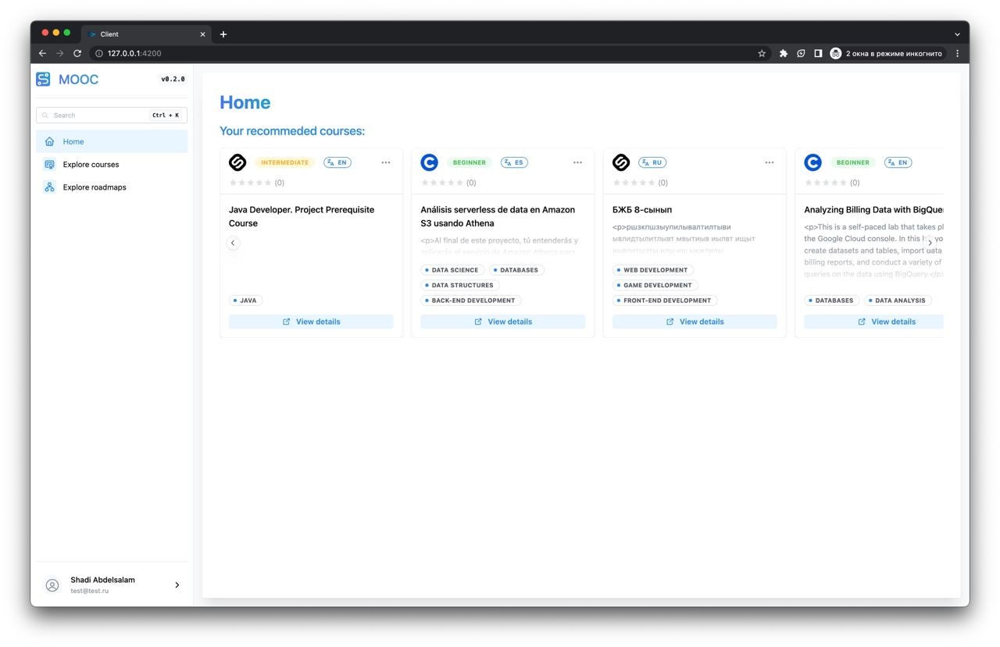
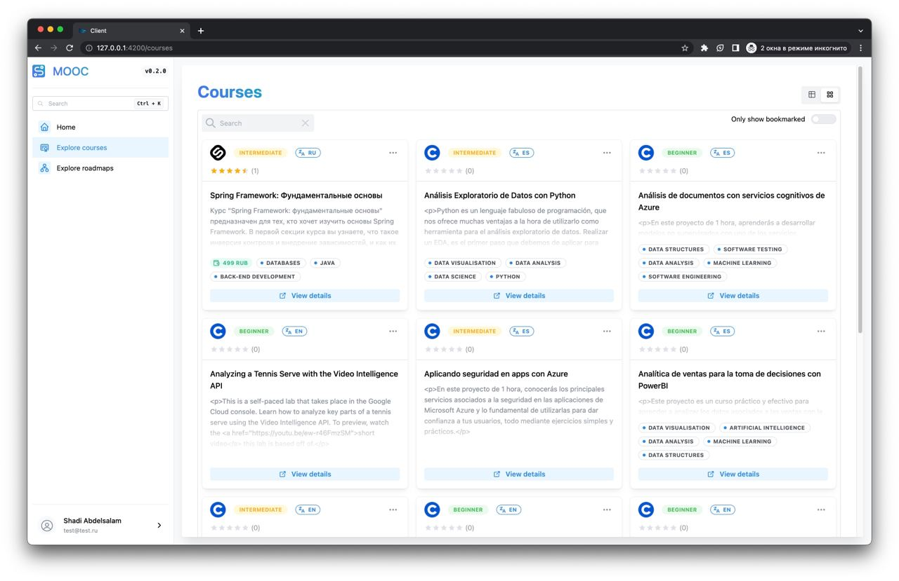
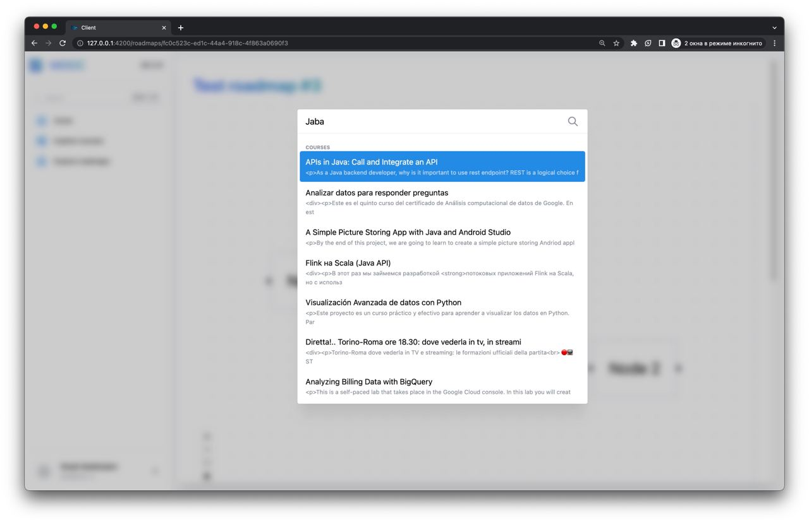
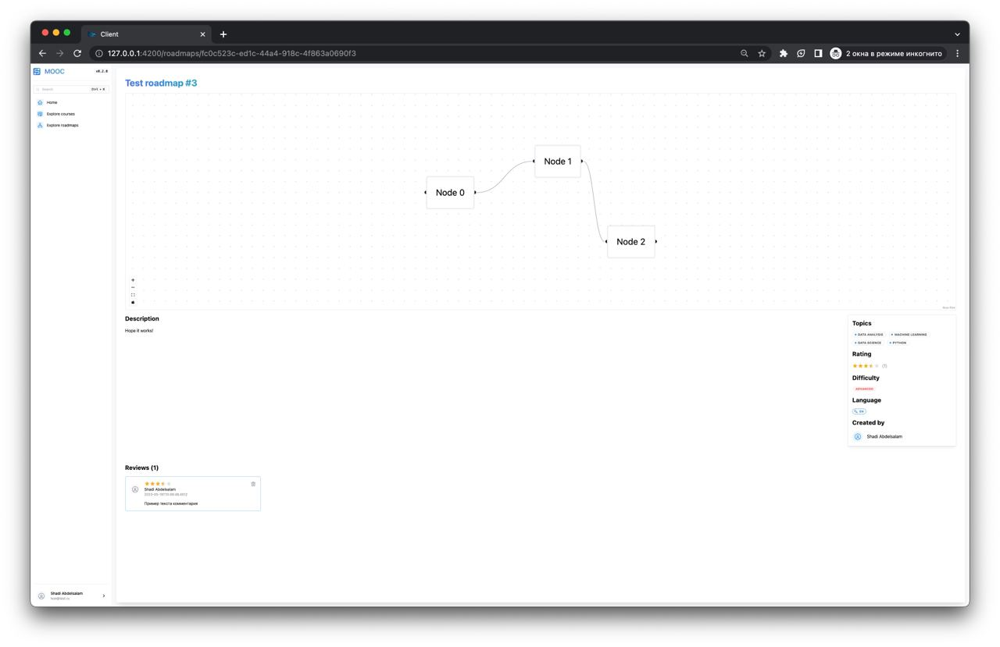

# TechPath - Diploma Project

> **Diploma Topic**: Information retrieval web application of MOOCs (mass open online courses) for IT specialties

# About the project

**TechPath** is a web platform developed to simplify searching for educational materials to study IT disciplines. Every person may find himself drowning in a vast variery of topics, paths and learning resources.

That is why this app may come in handy, helping to clear one's mind by suggesting hand-picked materials and roadmaps to learn a topic or even a whole profession.

## Screenshots

<p align="center">
  
  
  
  
  
</div>

## Architecture Overview

The repo consists of 5 packages (apps):

- **Client** - react web app
- **Server** - primary endpoint for a client app
- **Parser** - web crawler that parses data from different resources (e.g., Coursera, Stepik) and stores the unprocessed data in a RabbitMQ message queue
- **DataProcessor** - python script that processes courses data from the message queue - performs data cleanup, determines languages and tags
- **Shared** - components (e.g., utils, types, constants)

| System Architecture Diagram                                         | GraphQL Schema Diagram                                  |
| ------------------------------------------------------------------- | ------------------------------------------------------- |
|  |  |

> Blue color on architecture diagram describes a component that is to be added, red - a components that is not planned yet.

## Tech Stack

### Frontend

- `TypeScript`
- `React`
- `Mantine`
- `GraphQL`
- `Apollo`
- `Vite`

### Backend

- `TypeScript`
- `Nest.js`
- `Apollo`
- `Crawlee`
- `Neo4j`
- `RabbitMQ`

### Data Processor

- `Python`
- `Pika` (RabbitMQ adapter)
- `Neo4j`
- `Fasttext`
- `Transformers`

### Misc

- `Nx` (monorepo tool)
- `Docker`
- `Docker compose`

# Getting started

## Prerequisites

A list of required software:

- `npm`/`yarn`
- `docker`
- `python3`

## Installation

1. Clone the repo

```bash
git clone git@github.com:FloydanTheBeast/diploma.git
```

2. Install dependencies

```bash
npm i
# OR
yarn
```

3. Copy `env.example` config file and fill it with desired values
4. Create and start docker containers

```
docker-compose up -d
```

## Usage

1. Serve NX package - server, client or parser

```bash
nx serve <server|client|parser>
```

2. Generate GraphQL types based on a schema introspection for client or server

```bash
yarn gql-codegen:<client|server>
```

# Roadmap

## Server

- [x] Role-based JWT auth
- [x] Parse and process courses data from different vendors
- [x] Courses languages and tags classification
- [x] GraphQL API with CRUD operations for every entity
- [x] Data filtering, sorting, pagination and aggregation
- [x] Global fuzzy search for courses and roadmaps
- [x] Basic recommendation system
- [x] Roadmaps serialization and deserealization to the format supported by the client
- [ ] Train own model to improve classification accuracy
- [ ] User lists for saved courses/roadmaps
- [ ] Personalized courses/roadmaps compilations
- [ ] Tag clustering by specializations
- [ ] Personalized collaborative recommendation system, user data collection
- [ ] Testing system for users to determine their preferences
- [ ] CI/CD deployment pipeline

## Client

- [x] Basic JWT auth
- [x] Role-based routing
- [x] View courses, roadmaps and course vendors
- [x] Table pagination, search, sort and filter
- [x] Specific course page
- [x] Global search
- [x] Bookmarks for courses and roadmaps
- [x] In-app reviews for courses and roadmaps
- [x] View courses recommendations
- [x] Visual roadmap building tool
- [ ] Improve roadmaps visually
- [ ] Combine several roadmaps into a series
- [ ] Use roadmaps as template
- [ ] Stats dashboard for admins
- [ ] View user profiles
- [ ] Guest access to the app
- [ ] Internationalization
- [ ] Adaptation for mobile devices
- [ ] CI/CD deployment pipeline

---

> **2022-2023 Graduate Work (Diploma) by Shadi Abdelsalam** <br /> _Higher School of Economics, Faculty of Computer Science, Software Engineering Department_
